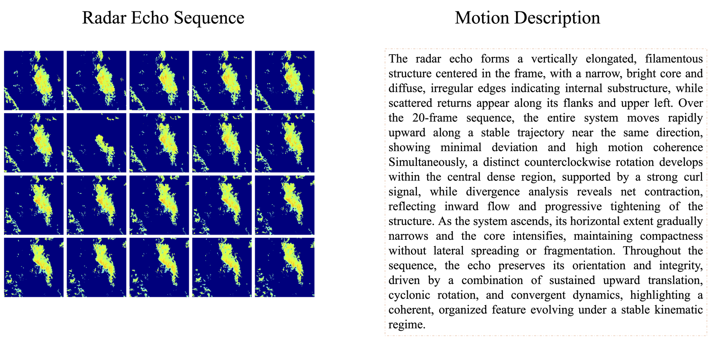
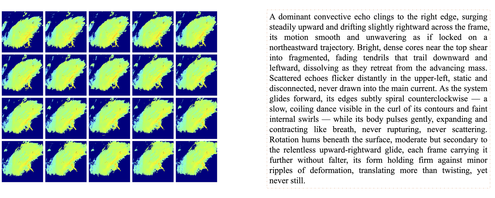
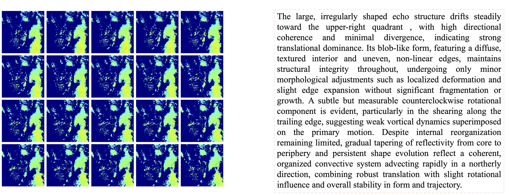

# LangPrecip: Language-Aware Multimodal Precipitation Nowcasting

**Language:** [English](#english) | [中文](#中文)

<p align="center">
  <a href="https://www.modelscope.cn/datasets/uussclear/LangPrecip-160K">
    
  </a>
</p>

## 数据样例 / Dataset Examples

The examples below show representative radar echo sequences paired with corresponding natural-language motion descriptions. Click any figure to view the corresponding high-resolution image.

**Example 1**

<p align="center">
  <a href="Img/datasetcase_case1.png">
    
  </a>
</p>

**Example 2**

<p align="center">
  <a href="Img/datasetcase_case2.png">
    
  </a>
</p>

**Example 3**

<p align="center">
  <a href="Img/datasetcase_case3.png">
    
  </a>
</p>

## 中文

**LangPrecip-160K** 是一个面向语言感知降水临近预报研究的大规模雷达-文本配对数据集，包含 **160K 条标注序列**。

该数据集来自我们的 ICML 2026 工作：

**[LangPrecip: Language-Aware Multimodal Precipitation Nowcasting](https://icml.cc/virtual/2026/poster/60525)**

### 数据集简介

短时降水临近预报本质上是一个欠约束问题：相同的历史雷达观测可能对应多种合理的未来降水演化轨迹，尤其是在强降水和极端天气场景中更为明显。

LangPrecip-160K 通过将雷达序列与自然语言运动描述进行配对，为语言感知降水临近预报提供数据支持。文本中的运动语义可以作为额外约束，用于降低未来降水轨迹生成中的运动歧义。

### 数据下载

数据集已发布在 ModelScope：

[点击访问 LangPrecip-160K 数据集页面](https://www.modelscope.cn/datasets/uussclear/LangPrecip160K)

请以 ModelScope 页面中的说明为准，获取最新的数据访问方式、文件组织结构和使用说明。

### 适用方向

LangPrecip-160K 可用于以下研究方向：

- 语言感知降水临近预报
- 雷达回波短时天气预报
- 多模态时空预测
- 文本引导生成式预报
- 降水运动语义理解

### 引用

如果您在研究中使用了 LangPrecip-160K，请引用我们的论文。

```bibtex
@article{langprecip2026,
  title   = {LangPrecip: Language-Aware Multimodal Precipitation Nowcasting},
  journal = {International Conference on Machine Learning},
  year    = {2026}
}
```

正式会议版本发布后，我们会更新完整引用信息。

## English

This repository provides the release information for **LangPrecip-160K**, a large-scale radar-text paired dataset for language-aware precipitation nowcasting.

LangPrecip-160K is introduced in our ICML 2026 work:

**[LangPrecip: Language-Aware Multimodal Precipitation Nowcasting](https://icml.cc/virtual/2026/poster/60525)**

## Dataset

Short-term precipitation nowcasting is inherently under-constrained: the same historical radar observations can lead to multiple plausible future precipitation trajectories, especially for heavy rainfall and extreme weather events. LangPrecip-160K is designed to support research on reducing this ambiguity by pairing radar sequences with natural-language motion descriptions.

The dataset contains **160K annotated radar-text sequences**. Each sample is built for language-aware precipitation nowcasting, where textual motion semantics can be used as additional guidance for forecasting future radar frames.

## Download

The dataset is released on ModelScope:

[https://www.modelscope.cn/datasets/uussclear/LangPrecip160K](https://www.modelscope.cn/datasets/uussclear/LangPrecip160K)

Please refer to the ModelScope page for the latest access instructions, file organization, and usage notes.

## Paper

- **Paper:** [arXiv:2512.22317](https://arxiv.org/pdf/2512.22317)
```
@article{ling2025langprecip,
  title={Langprecip: Language-aware multimodal precipitation nowcasting},
  author={Ling, Xudong and Li, Chaorong and Huang, Tianxi and Dong, Qian and Duan, Guiduo},
  journal={arXiv preprint arXiv:2512.22317},
  year={2025}
}
```

## Suggested Uses

LangPrecip-160K can be used for research on:

- language-aware precipitation nowcasting
- radar-based short-term weather forecasting
- multimodal spatiotemporal prediction
- text-guided generative forecasting
- precipitation motion understanding

## Citation

If you use LangPrecip-160K in your research, please cite our paper.

```bibtex
@article{langprecip2026,
  title   = {LangPrecip: Language-Aware Multimodal Precipitation Nowcasting},
  journal = {International Conference on Machine Learning},
  year    = {2026}
}
```

The complete citation will be updated after the official proceedings version is available.

## Acknowledgements

We sincerely thank the following open-source projects for their valuable contributions to the research community:

- [Open-Sora](https://github.com/hpcaitech/Open-Sora/)
- [DiT](https://github.com/facebookresearch/DiT)
- [PixArt-alpha](https://github.com/PixArt-alpha)
- [skillful_nowcasting](https://github.com/openclimatefix/skillful_nowcasting)
- [latent-diffusion](https://github.com/CompVis/latent-diffusion)
- [DiffCast](https://github.com/DeminYu98/DiffCast)
- [Qwen](https://github.com/QwenLM/Qwen)
- [RectifiedFlow](https://github.com/gnobitab/RectifiedFlow)
- [Latte](https://github.com/Vchitect/Latte)
- [temporal-shift-module](https://github.com/mit-han-lab/temporal-shift-module)
- [rainnet](https://github.com/hydrogo/rainnet)
